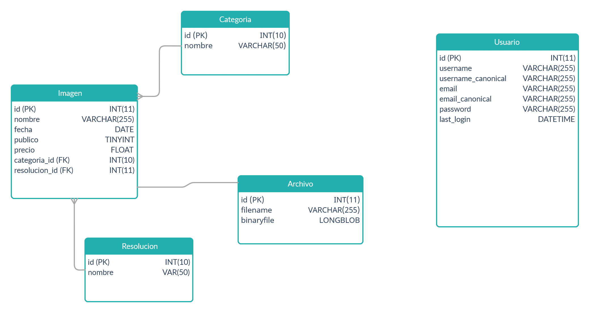

# Proyecto inicial
 

## Idea a Implementar

#### La idea es implementar un conjunto de aplicaciones que permita administrar una base de datos con imágenes y buscarlos a traves de distintos campos y criterios.  
 

## Tema y conexión

#### Para llevar a cabo los proyectos se propone como tema desarrollar una aplicación que permita administrar el portfolio y la store de un diseñador gráfico, con sus fotos, ilustraciones y trabajos en 3D, asi como también administrar los clientes. 
 

## Diagrama ER

## Actualización de los datos

#### El proyecto Framework PHP - Laravel permitirá:
 

#### A usuarios con rol edición:

* cargar, editar y borrar imágenes.
* cargar, editar y borrar categorías.
* cargar, editar y borrar resoluciones.
* cargar y borrar archivos.

#### A usuarios con rol administrador:

* administrar usuarios.
* lo mismo que los usuarios con rol edición.
 
 

## Información del servicio Web

#### El servicio web permitirá acceder a las distintas imágenes, filtrando por uno o mas de los siguientes campos:

* categoría
* resolución
* fecha
* autor
* nombre
* id
* precio
 
 

## Visualización y acceso a la información

#### El proyecto en React permitirá al usuario acceder logueandose o de manera anónima, ademas le permitirá ver las distintas fotografiás e ilustraciones de manera amigable, posibilitando la búsqueda a traves de diversos filtros. Si el usuario ingresa logueandose podrá añadir los trabajos que desee a un carrito virtual para realizar su posterior compra,  si es que asi lo desea. Posteriormente podrá realizar la descarga del archivo adquirido.

